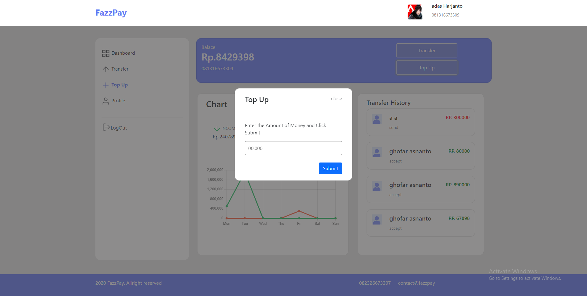

# <h1 align="center">**FAZZPAY**</h1>

<center>

<p><b> Fazzpay is an application that focussing in banking needs for
                all users in the world. You can top up your balance via e-banking or tranfer to your friends in easy way</b></p>

</center>
<br/>

<br/>
<hr/>

<!-- <span style='font-size:20px;'>&#128204;</span> -->

## **Contents**

<br/>

- [**Instalation**](#instalation)

- [**What To Do**](#what-to-do)

- [**Feature Desc**](#feature-desc)

- [**Preview**](#preview)

- [**Download**](#Download)

<br/>
<hr/>

## **Instalation**

<br/>

1. Clone this repository

   ```bash
   $ git clone https://github.com/irvanmnwr/fazzpay
   ```

2. Open Project Folder

   ```
   $ cd fazzpay
   ```

3. Instal Depedencies

   ```
   $ npm install
   ```

4. Add next.config.js

   ```
    URL_BACKEND:

    CLAUDINARY:

   ```

5. Run the Project
   ```
   $ npx run dev
   ```

<br/>
<hr/>

## **What To Do ?**

<br/>

1. Register using your real information
2. Open your registered email address
3. Open email and follow the instruction to verify your account
4. Login and use all of the feature in **Fazzpay**

<br/>
<hr/>

## **Feature Desc**

### <span style='font-size:15px;'>&#10032;</span> when top up, fazzpay provides the following features:

- Feature Pay order via e-banking.
- Show your top Up history
- view your balance in graph

### <span style='font-size:15px;'>&#10032;</span> when Transfer, fazzpay provides the following features:

- select account to transfer.
- get notes
- secure with pin
- get notifications

### <span style='font-size:15px;'>&#10032;</span> Edit Profile, fazzpay provides the following features:

- Image upload in library,
- Update Profile ,Password, and pin,

<br/>
<hr/>

## **Preview**

<p align="center">
<br />
<br />
<br />
<br />
<br />
</p>

<br/>
<hr/>

## **Deploy**

### **Enjoy your journey with Fazzpay** >> Link : [**Fazzpay**](https://fazzpay-acr3z20oq-irvanmnwr.vercel.app/)

<br/>
<hr/>
